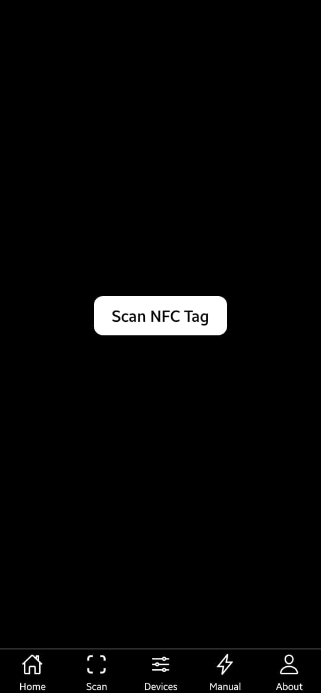

# NFC Tasker – IoT Automation via NFC Tags

NFC Tasker is a contactless smart control system built using Python and Flask, designed to manage physical devices (relays, LEDs, etc.) via NFC triggers and a mobile-friendly dashboard. It enables automation, manual override, and remote device management through a REST API, operating on Raspberry Pi hardware with GrovePi.

---

## Features

### 1. NFC Trigger-Based Device Control
Each NFC tag corresponds to a specific command (e.g., toggle GPIO port 7). When scanned, it activates the assigned task using a secure REST API.

### 2. Manual Control Dashboard
Users can manually switch GPIO-connected devices on/off through an intuitive mobile-optimized web interface.

### 3. Device Management
Users can name and label GPIO ports, manage device state, and view all devices in a simple list format.

### 4. Secure RESTful API
`/operate_relay` endpoint receives tag scan requests and triggers corresponding GPIO actions.

### 5. GPIO Integration
Built to work with Raspberry Pi + GrovePi kits to support educational, industrial, or accessibility-focused deployments.

---

## Technologies Used

- **Backend:** Python (Flask), GrovePi, Socket, REST API
- **Frontend:** HTML, CSS, JavaScript (jQuery)
- **Hardware:** Raspberry Pi, GrovePi, GPIO relay boards
- **Server Location:** `./server/HTTPS.py`

---

## Installation

### Hardware Requirements
- Raspberry Pi with Raspbian OS
- GrovePi kit with relays, LEDs, and supported GPIO modules
- NFC-enabled device (Android recommended) for scanning

### Software Setup

1. Clone this repository
   ```bash
   git clone https://github.com/yourusername/nfc-tasker.git
   cd nfc-tasker
   ```

2. Install Python dependencies
   ```bash
   pip install flask grovepi
   ```

3. Ensure GrovePi is installed and initialized on your Pi.

4. Start the Flask server
   ```bash
   cd server
   python HTTPS.py
   ```

5. Access the app from your mobile device
   ```
   http://<server-ip-address>:8080
   ```

---

## Project Structure

```
nfc-tasker/
├── server/
│   └── HTTPS.py
├── static/
│   ├── style.css
│   └── scripts.js
├── templates/
│   ├── index.html
│   └── manual_control.html
├── screenshots/
│   ├── IMG-20230627-WA0001.jpg
│   ├── IMG-20230627-WA0003.jpg
│   ├── IMG-20230627-WA0004.jpg
│   ├── IMG-20230627-WA0005.jpg
├── README.md
└── LICENSE
```

---

## Screenshots

| Home Screen | Scan Interface | Manual Control | Device List |
|-------------|----------------|----------------|-------------|
|  |  |  |  |

---

## How It Works

1. NFC tag is scanned by a mobile device (using an NFC writer app).
2. The tag’s command (e.g., `"toggle 7"`) is sent to the Raspberry Pi over Wi-Fi using a POST request.
3. Flask app hosted in `HTTPS.py` reads the tag, parses the command, and uses GrovePi to activate the designated GPIO port.
4. Manual control interface allows real-time toggling and feedback on device state.
5. User can configure device names and ports via the UI or JSON config (future extension).

---

## Use Cases

- Smart home and lighting control
- Contactless switches for accessibility
- Classroom/lab automation
- Industrial relay toggling via tags
- NFC access control for specific functions

---

## Contributors

- [Vinit Shingala](https://github.com/vinitshingala31)

---

## License

This project is licensed under the **GNU Affero General Public License v3.0**.  
See the full LICENSE file for more details.
